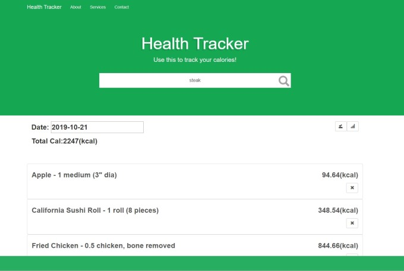

# Health-Tracker Project 

[English Version](https://github.com/henry32144/health-tracker/blob/master/README(en).md)

這是一個健康紀錄應用，可以記錄每日吃的熱量，從Nutritionix取得資料，並且儲存到Firebase。

**Firebase API 金鑰已過期，所以無法儲存**

## DEMO

https://henry32144.github.io/health-tracker/

## How to use

下載後，點擊index.html

* 這個app有兩個按鈕，一個是儲存資料的，一個是顯示圖表。由於Firebase API 金鑰已過期，所以無法儲存。

* 顯示圖表的按鈕會顯示從左邊選擇的日期以來過去7天的資料。

## Attention

* 項目中使用的Nutritionix API 由於是免費用戶，每日只能搜索500次，有時候可能出現被限制搜尋的情況

## Built With

* [Jquery-3.2.1](https://jquery.com/)
* [Jquery-UI-1.12.1](http://jqueryui.com/)
* [Backbone-1.3.3](http://backbonejs.org/)
* [Underscore-1.8.3](http://underscorejs.org/)
* [Bootstrap-3.3.7](http://getbootstrap.com/)
* [Chart.js-2.6.0](http://www.chartjs.org/)
* [Firebase-4.2.0](https://firebase.google.com/)

## Author

* **Henry Wu** [Hello :)](https://github.com/henry32144)
